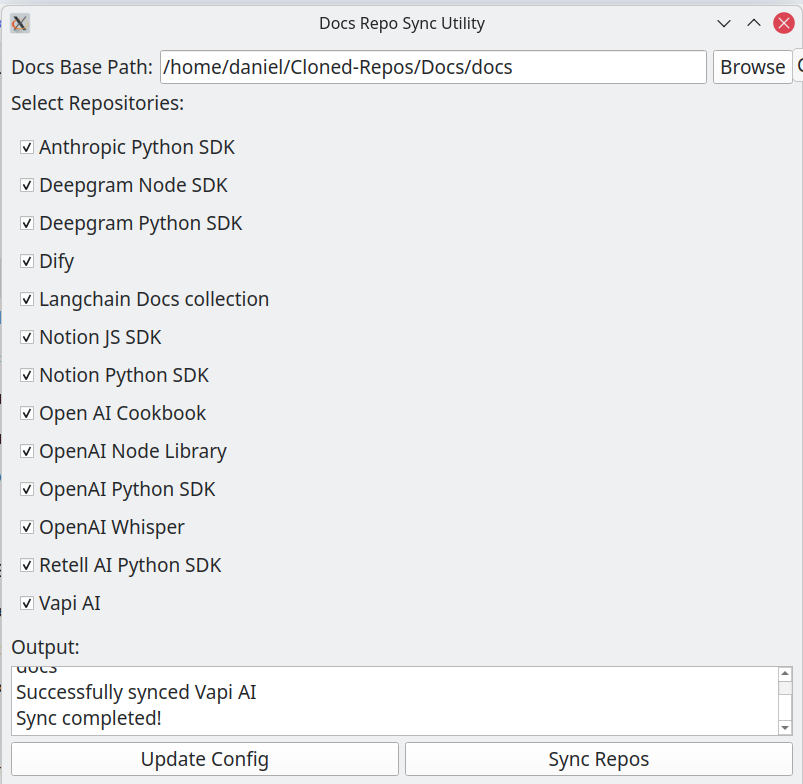

# API & SDK Docs Pipeline (For RAG)

 The purpose of this repository is to provide a simple GUI for generating, managing and syncing a cluster of documentation repositories documenting the operation of various APIs and SDKs.

 The ultimate objective is to streamline a documentation ingestion pipeline to funnel these into a vector database for RAG. 

 The intended use-case is grounding code generation assistants and agents on updated documentation of the tools that the developer frequently uses.

1. **Repository Management**:
   - Repositories are defined in `repos.csv` with their names and URLs
   - The application loads these repositories and displays them in a checklist

2. **Configuration**:
   - Configuration is stored in `.meta` file in JSON format
   - Includes the base docs directory path and selected repositories
   - Configuration is updated when user clicks "Update Config"

3. **Synchronization**:
   - User selects repositories to sync and clicks "Sync Repos"
   - For each selected repository:
     - If not already cloned, the repository is cloned to the docs directory
     - If already cloned, the latest changes are pulled
   - Repository folder names are derived from their URLs

4. **GUI Components**:
   - Docs base path selection with browse button
   - Checkable list of repositories
   - Output log area
   - Update Config and Sync Repos buttons

## Requirements

- Python 3.x
- PyQt6
- Git

## Author

Daniel Rosehill  
(public at danielrosehill dot com)

## Licensing

This repository is licensed under CC-BY-4.0 (Attribution 4.0 International) 
[License](https://creativecommons.org/licenses/by/4.0/)

### Summary of the License
The Creative Commons Attribution 4.0 International (CC BY 4.0) license allows others to:
- **Share**: Copy and redistribute the material in any medium or format.
- **Adapt**: Remix, transform, and build upon the material for any purpose, even commercially.

The licensor cannot revoke these freedoms as long as you follow the license terms.

#### License Terms
- **Attribution**: You must give appropriate credit, provide a link to the license, and indicate if changes were made. You may do so in any reasonable manner, but not in any way that suggests the licensor endorses you or your use.
- **No additional restrictions**: You may not apply legal terms or technological measures that legally restrict others from doing anything the license permits.

For the full legal code, please visit the [Creative Commons website](https://creativecommons.org/licenses/by/4.0/legalcode).